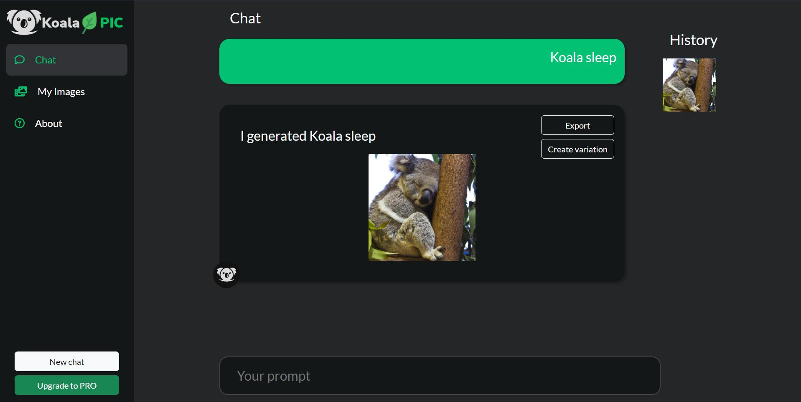

# KoalaPIC Web-додаток для генерації зображень з тексту




Цей проект містить веб-додаток для генерації зображень з введеного користувачем тексту. Ви можете використовувати цей додаток, щоб створювати графічні зображення для ваших соціальних мереж, блогів, сайтів та інших проектів.


# Встановлення

1) Збірка Docker
```bash
docker build -t koalapic . 
```

2) Запуск Docker
```bash
docker run -p 5000:80 koalapic
```

3) Переходьте до http://localhost:5000/


### Docker compose
```bash
docker compose up
```

## API Reference

#### Генерація зображення

```http
  GET /api/generate
```

| Параметр | Тип     | Опис                |
| :-------- | :------- | :------------------------- |
| `prompt` | `string` | **Обов'язкове**. Ваш текст  |


Результатом буде URL-посилання на згенероване зображення.

## Розробники

- [@MethaTrader](https://www.github.com/MethaTrader)
- [@Moqu3f](https://github.com/Moqu3f)
- [@zetatul](https://github.com/zetatul)
- [@dezmond338](https://github.com/dezmond338)
- [@naumenkoanatoly](https://github.com/naumenkoanatoly)
